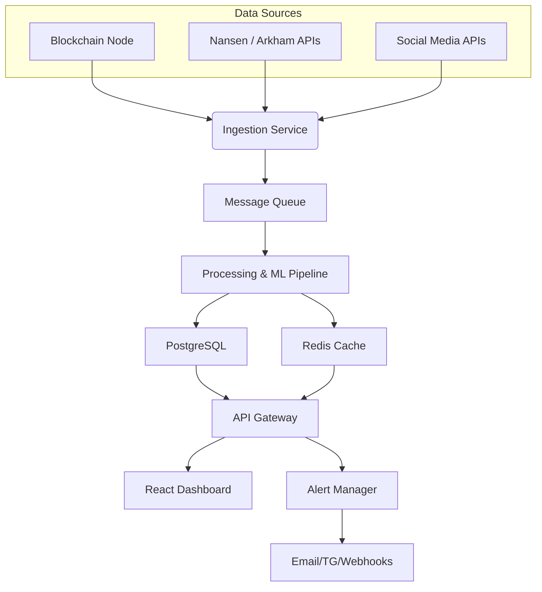

# Clairvoy.xyz Technical Specification

This document outlines the recommended technology stack, infrastructure layout, and major components used to operate Clairvoy.xyz. The platform ingests blockchain transactions, enriches them with third‑party intelligence, and surfaces alerts and dashboards for analysts.

## Technology Stack

| Layer                  | Technology                                                     |
|------------------------|----------------------------------------------------------------|
| **Backend**            | Node.js (REST API), Python analytics services                 |
| **Data Processing**    | Python (pandas, scikit‑learn, PyTorch)                         |
| **Database**           | PostgreSQL for structured data, Redis for caching              |
| **Message Queue**      | RabbitMQ or Apache Kafka                                       |
| **Front End**          | React / Next.js dashboard                                      |
| **Infrastructure**     | Docker containers orchestrated by Kubernetes                   |
| **Cloud**              | AWS (EC2, RDS, S3, EKS) or equivalent cloud provider          |

## Infrastructure Requirements

1. **Blockchain Node Access** – connect via providers like Infura or Alchemy for Ethereum RPC calls.
2. **Analytics Servers** – scalable compute instances running the Python analysis pipeline.
3. **Database Cluster** – managed PostgreSQL instance with replicas for high availability.
4. **Object Storage** – S3 buckets to archive transaction logs and model artifacts.
5. **Cache / Queue Layer** – Redis for caching hot data and RabbitMQ/Kafka for task queues.
6. **Container Orchestration** – Kubernetes cluster (EKS) to manage backend services, workers, and cron jobs.
7. **Monitoring & Logging** – Prometheus, Grafana, and ELK stack for observability.
8. **Alerting Channels** – SMTP server, Telegram bot API, and webhook endpoints for notifications.

## System Components

- **Ingestion Service** – polls blockchain nodes and 3rd‑party APIs for new transactions and wallet metadata.
- **Enrichment Service** – integrates labels from services like **Nansen**, **Arkham Intelligence**, and other reputable data providers.
- **Processing & ML Pipeline** – performs heuristic checks and machine‑learning inference to assign risk scores and generate narrative summaries.
- **Storage Layer** – PostgreSQL stores normalized transactions, wallet profiles, and risk scores. Redis caches frequently accessed data.
- **API Gateway** – exposes REST endpoints for the dashboard and external integrations.
- **Dashboard** – React interface showing transaction history, wallet relations, and alert settings.
- **Alert Manager** – dispatches notifications via email, Telegram, and custom webhooks.
- **Human‑in‑the‑Loop Tools** – allows analysts to update insider lists and provide feedback to the models.

### Third‑Party Services

- **Blockchain Node Provider:** Infura or Alchemy
- **Intelligence Feeds:** Nansen, Arkham Intelligence
- **Email Service:** AWS SES or SendGrid
- **Messaging:** Telegram Bot API
- **Hosting/Cloud:** AWS (EC2/EKS/RDS/S3)

## Architecture Overview

This diagram summarizes the flow from data sources through processing and storage to the user‑facing components.

